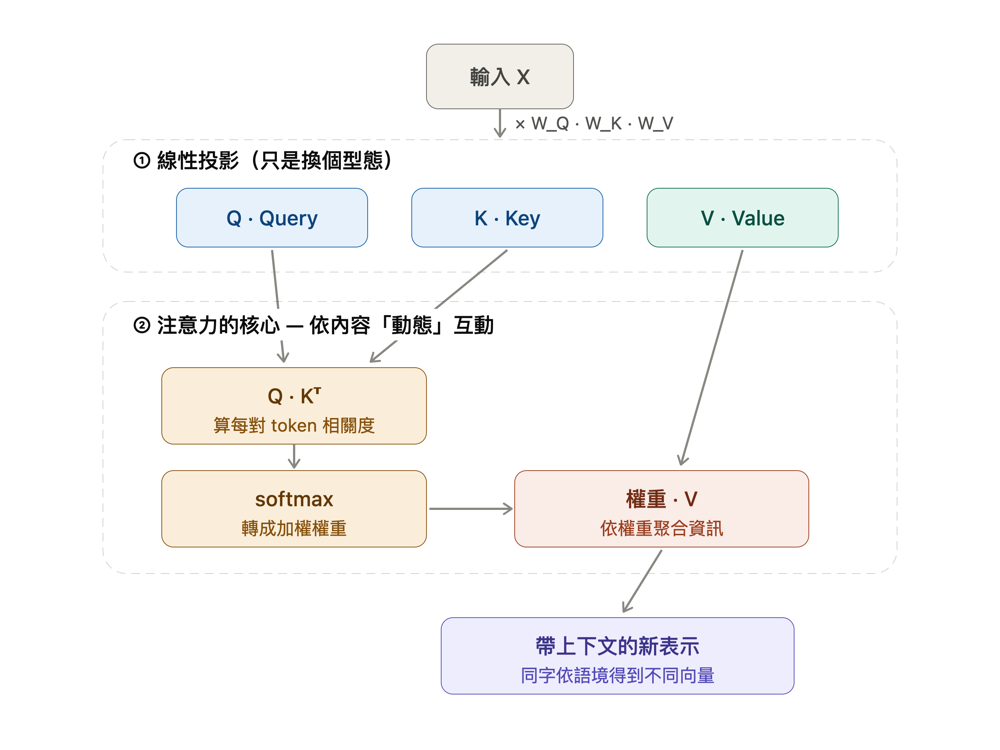
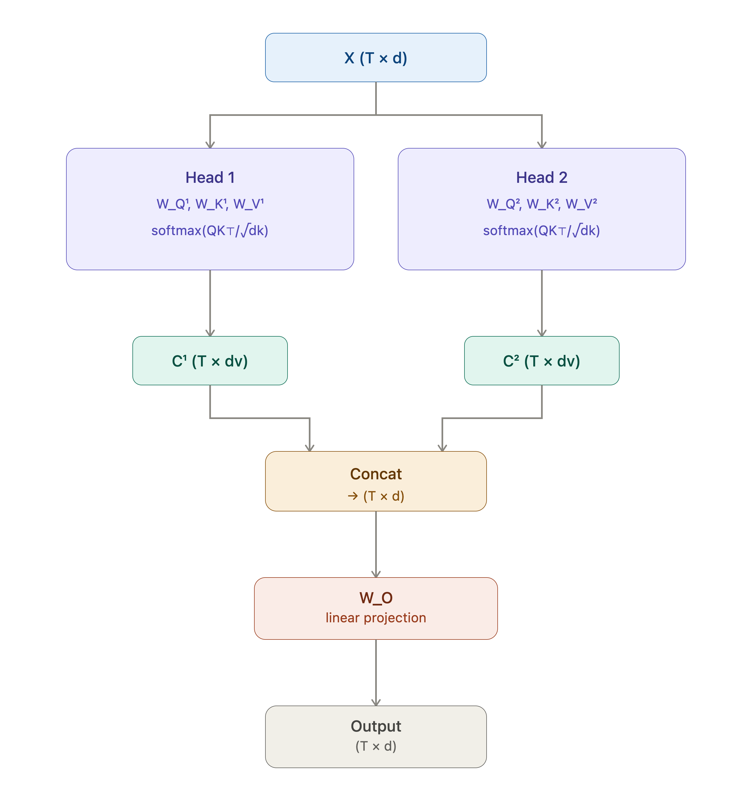
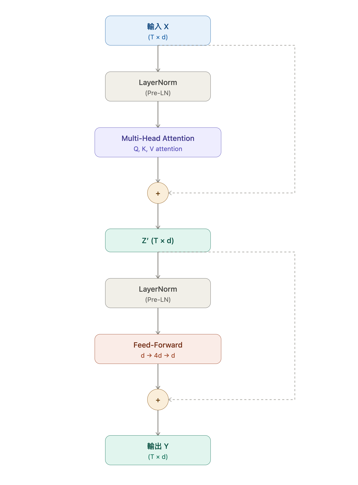

# 03a｜Transformer 架構：QKV → Multi-Head → Block → 位置編碼

> **適合對象：** 讀完 01b（或熟悉 01a）與 02 後，想理解完整 Transformer 架構的讀者。
>
> **讀完後你能做什麼：**
> - 推導 Naive Self-Attention 的三個限制，以及 QKV 如何解決它們
> - 說明 Scaled Dot-Product Attention 中除以 $\sqrt{d_k}$ 的統計學原因
> - 解釋 Multi-Head Attention 的架構與 Shape 計算
> - 描述一個完整 Transformer Block 的組成：兩個子層（MHA、FFN），每個子層各配一組 LN 與 Residual
> - 解釋 Sinusoidal Positional Encoding 的設計動機
>
> **前置文件：** [`01b-prerequisites-math.md`](01b-prerequisites-math.md)、[`02-attention-intuition.md`](02-attention-intuition.md)
>
> **注意：** 本文件不含反向傳播推導，梯度推導請見 [`05-backpropagation.md`](05-backpropagation.md)
>
> **學完後的下一步：** → [`04-gpt-decoder-only.md`](04-gpt-decoder-only.md)（Causal Masking 與 nanoGPT 橋接）

---

> 本文件將 Pre-Transformer 的基本形式：
>
> $ c_i = \sum_j \text{softmax}(x_i^\top x_j) \, x_j $
>
> 推廣為完整 Transformer 架構，涵蓋 Multi-Head Attention、Transformer Block、Positional Encoding。
> 反向傳播推導請見 [`05-backpropagation.md`](05-backpropagation.md)。


---

## 目錄

1. Self-Attention 的限制
2. Query / Key / Value 的動機
3. Scaled Dot-Product Attention
4. 矩陣形式與 Shape 分析
5. Multi-Head Attention
6. Transformer Block
7. Positional Encoding
8. 與 RNN 的結構差異

---

## 符號表

全文符號統一定義如下（向量為 row-vector，序列以矩陣 $X$ 的「列」存放 token）：

| 符號 | 含義 | 形狀 |
|---|---|---|
| $T$ | 序列長度（token 數）| — |
| $d$ | 模型隱藏維度（model dimension）| — |
| $d_k,\ d_v$ | 單一 head 的 Q/K、V 維度（通常 $=d/H$）| — |
| $d_{ff}$ | FFN 中間層維度（通常 $4d$）| — |
| $H,\ h$ | head 總數、head 索引 | — |
| $X$ | 輸入序列（每列一個 token）| $T \times d$ |
| $x_i$ | 第 $i$ 個 token 向量 | $d$ |
| $W_Q, W_K, W_V$ | QKV 投影矩陣 | $d\times d_k$、$d\times d_v$ |
| $W_O$ | 輸出投影矩陣 | $d\times d$ |
| $Q, K, V$ | Query／Key／Value 矩陣 | $T\times d_k$、$T\times d_v$ |
| $S=[S_{ij}]$ | **原始**注意力分數 $q_i^\top k_j$（未縮放）| $T\times T$ |
| $E=[E_{ij}]$ | **縮放後**分數 $S_{ij}/\sqrt{d_k}$ | $T\times T$ |
| $A=[A_{ij}]$ | 注意力權重（$E$ 經 softmax，逐元素時亦記 $\alpha_{ij}$）| $T\times T$ |
| $c_i,\ C$ | 單頭 context 向量／矩陣 | $d_v$、$T\times d_v$ |
| $O$ | Multi-Head Attention 的最終輸出 | $T\times d$ |

> **索引慣例：** $i,j,l$ 為 token／求和索引（§7 中 $i$ 改指位置索引）；$m$ 為位置編碼的維度配對索引（§7，範圍 $0 \le m < d/2$，一個 $m$ 對應第 $2m$、$2m+1$ 兩個維度）；$h$ 為 head 索引。
> **softmax 慣例：** $\text{softmax}_\text{row}$ 指對矩陣每一列正規化；逐元素時等價於對下標 $j$ 正規化（記 $\text{softmax}_j$）。

---

## 1. Self-Attention 的限制

回顧 Pre-Transformer 的原始形式：

$$
S_{ij} = x_i^\top x_j, \qquad c_i = \sum_j \text{softmax}_j(x_i^\top x_j) \cdot x_j
$$

這個設計存在兩個根本限制：

### 限制一：角色混淆

同一個向量 $x_i$ 同時扮演三種角色：

| 角色 | 語意 | 在 naive 版本中 |
|---|---|---|
| 查詢（Query） | 「我要找什麼」 | $x_i$（用於計算 $x_i^\top x_j$）|
| 鍵（Key） | 「我能被如何匹配」 | $x_j$（用於計算 $x_i^\top x_j$）|
| 值（Value） | 「我實際提供的資訊」 | $x_j$（用於加權平均）|

三種語意不同的操作共用同一個向量，表達能力受限。

### 限制二：對稱性

因為 $S_{ij} = x_i^\top x_j = x_j^\top x_i = S_{ji}$，原始分數矩陣 $S$ 是**對稱矩陣**。

這意味著：「$i$ 關注 $j$ 的程度」= 「$j$ 關注 $i$ 的程度」。

但自然語言中的依賴關係往往是非對稱的。例如代名詞「它」指向名詞的關係，與名詞被代名詞引用的關係，語意強度不同。

### 限制三：無可學習的投影

整個計算過程沒有任何可訓練參數（除了 embedding 本身），模型無法透過梯度學習「什麼是好的相似度」。

三個限制有一個統一的解法：引入三組獨立的線性投影——下一節說明 QKV 如何分別解決這三個問題。

---

## 2. Query / Key / Value 的動機

解決方案：引入三個**獨立的線性投影矩陣**，將輸入向量投影到不同的子空間，分別扮演不同角色。

### 2.1 定義投影

$$
q_i = W_Q^\top x_i \in \mathbb{R}^{d_k}, \qquad
k_j = W_K^\top x_j \in \mathbb{R}^{d_k}, \qquad
v_j = W_V^\top x_j \in \mathbb{R}^{d_v}
$$

其中可學習參數（採與後文矩陣式 $Q=XW_Q$ 一致的 $d\times d_k$ 慣例；單一 token 左乘時取轉置）：

$$
W_Q \in \mathbb{R}^{d \times d_k}, \quad
W_K \in \mathbb{R}^{d \times d_k}, \quad
W_V \in \mathbb{R}^{d \times d_v}
$$

**Shape 說明：**

| 變數 | Shape | 說明 |
|---|---|---|
| $X$ | $T \times d$ | 輸入序列 |
| $W_Q, W_K$ | $d \times d_k$ | Query/Key 投影（通常 $d_k = d/H$）|
| $W_V$ | $d \times d_v$ | Value 投影（通常 $d_v = d/H$）|
| $Q, K$ | $T \times d_k$ | Query/Key 矩陣 |
| $V$ | $T \times d_v$ | Value 矩陣 |

### 2.2 語意分離

| 投影 | 問題 | 語意 |
|---|---|---|
| Query $q_i$ | 「我要找什麼資訊？」 | 當前 token 的查詢意圖 |
| Key $k_j$ | 「我能提供什麼資訊的索引？」 | 其他 token 的可被匹配特徵 |
| Value $v_j$ | 「我實際提供的內容是什麼？」 | 其他 token 的資訊內容 |

分離之後：

- $q_i^\top k_j$：匹配分數，不再對稱（因為 $W_Q \neq W_K$）
- 讀取的值 $v_j$ 可與匹配用的 $k_j$ 完全不同
- $W_Q, W_K, W_V$ 均為可學習參數

### 2.3 最小數值例子：同一 token 的三種角色

上面的語意分離表是抽象的，這裡用一個最小例子把它算出來：看同一個 token 向量，經過三組投影後如何變成三個不同的向量。

**輸入（3 個 token，每個原本 2 維）：**

$$
X=
\begin{bmatrix}
1 & 0 \\
0 & 1 \\
1 & 1
\end{bmatrix}
\quad\Rightarrow\quad
x_1=[1,0],\; x_2=[0,1],\; x_3=[1,1]
$$

**三個刻意取簡單的投影矩陣（$d=d_k=d_v=2$）：**

$$
W_Q=
\begin{bmatrix}
1 & 0 \\
0 & 1
\end{bmatrix}
,\quad
W_K=
\begin{bmatrix}
1 & 1 \\
0 & 1
\end{bmatrix}
,\quad
W_V=
\begin{bmatrix}
2 & 0 \\
0 & 1
\end{bmatrix}
$$

代入 §4 的矩陣式 $Q=XW_Q$、$K=XW_K$、$V=XW_V$（以下 $q_i,k_j,v_j$ 為 $X$、$Q$、$K$、$V$ 各列，即 §2.1 定義的逐列展開）：

$$
Q=
\begin{bmatrix}
1 & 0 \\
0 & 1 \\
1 & 1
\end{bmatrix}
,\quad
K=
\begin{bmatrix}
1 & 1 \\
0 & 1 \\
1 & 2
\end{bmatrix}
,\quad
V=
\begin{bmatrix}
2 & 0 \\
0 & 1 \\
2 & 1
\end{bmatrix}
$$

**關鍵觀察：同一個 token 的三種角色。** 以第 1 個 token 為例，它原本是 $x_1=[1,0]$，但經過三組投影後變成：

$$
q_1=[1,0]\;(\text{查詢別人時的樣子}),\quad
k_1=[1,1]\;(\text{被別人匹配時的樣子}),\quad
v_1=[2,0]\;(\text{實際提供出去的內容})
$$

這正是 §2.2 那張表的數值化：同一個輸入，被拆成「我要找什麼」「我能如何被找到」「我實際提供什麼」三個獨立向量。

**算出注意力分數 $S=QK^\top$**（此即 §3.1 的逐元素分數，符號表中的未縮放分數矩陣 $S$）：

$$
K^\top=
\begin{bmatrix}
1 & 0 & 1 \\
1 & 1 & 2
\end{bmatrix}
\quad\Rightarrow\quad
S=QK^\top=
\begin{bmatrix}
1 & 0 & 1 \\
1 & 1 & 2 \\
2 & 1 & 3
\end{bmatrix}
,\qquad S_{ij}=q_i^\top k_j
$$

看第一列 $S_{1,:}=[1,0,1]$：token 1 查詢時，$q_1\cdot k_1=1$、$q_1\cdot k_2=0$、$q_1\cdot k_3=1$，也就是它對 token 1 與 token 3 較有興趣、對 token 2 較沒興趣。

接著把這一列分數轉成權重、再混合 Value。此處 $d_k=2$ 很小，為突顯動機**暫略 $\sqrt{d_k}$ 縮放**（縮放的必要性見 §3.4），直接對第一列做 softmax——先對三個分數取指數 $e^{1}\approx2.718,\;e^{0}=1,\;e^{1}\approx2.718$，總和 $2.718+1+2.718=6.436$，再各除以總和：

$$
\text{softmax}([1,0,1])
=\frac{[\,e^{1},\,e^{0},\,e^{1}\,]}{e^{1}+e^{0}+e^{1}}
=\frac{[2.718,\,1,\,2.718]}{6.436}
\approx[0.422,\,0.155,\,0.422]\qquad(\text{未除以 }\sqrt{d_k})
$$

$$
c_1=0.422\,v_1+0.155\,v_2+0.422\,v_3
=0.422[2,0]+0.155[0,1]+0.422[2,1]
=[1.688,\,0.577]
$$

同樣對第二、三列分數 $S_{2,:}=[1,1,2]$、$S_{3,:}=[2,1,3]$ 做（未縮放）softmax，再加權混合 Value：

$$
\text{softmax}([1,1,2])
=\frac{[2.718,\,2.718,\,7.389]}{12.826}
\approx[0.212,\,0.212,\,0.576]
$$

$$
c_2=0.212[2,0]+0.212[0,1]+0.576[2,1]=[1.576,\,0.788]
$$

$$
\text{softmax}([2,1,3])
=\frac{[7.389,\,2.718,\,20.086]}{30.193}
\approx[0.245,\,0.090,\,0.665]
$$

$$
c_3=0.245[2,0]+0.090[0,1]+0.665[2,1]=[1.820,\,0.755]
$$

也就是說，token 1 依 Query–Key 的匹配結果，主要讀取 token 1 與 token 3 的 Value，少量讀取 token 2 的 Value；token 2、token 3 則都因分數最高的 $k_3$ 而最重視 token 3 的 Value。

#### 補充與說明

⚠️ **注意：這一節「沒有」做縮放，從分數變成 context。**

> 為了先把「分數 → 權重 → 混合」的邏輯講清楚，本節的 softmax 直接吃原始分數 $[1,0,1]$，**跳過了除以 $\sqrt{d_k}$ 這一步**。因此這裡算出的權重 $[0.422,0.155,0.422]$ 與 context $c_1=[1.688,0.577]$ 都是「未縮放」的結果。完整含縮放的版本在 §3.2–§3.3，兩者的並排對照見 §3.3「縮放前後對照」。

這條「$Q$ 決定看誰、$V$ 決定讀到什麼」的流程，下一節補上 $\sqrt{d_k}$ 縮放後就是完整的 Scaled Dot-Product Attention。

---

## 3. Scaled Dot-Product Attention

### 3.1 原始注意力分數

§2.3 已用具體數字算過一次，這裡給出一般定義。把 token $i$ 的 query $q_i$ 與 token $j$ 的 key $k_j$（§2.1 的 Query／Key 投影）做內積，得到[**原始注意力分數** $S$](#符號表)（未縮放）：

$$
S_{ij} = q_i^\top k_j = (W_Q^\top x_i)^\top (W_K^\top x_j)
$$

$S_{ij}$ 衡量「token $i$ 作為 query 時、對 token $j$ 的 key 有多匹配」，整個 $S\in\mathbb{R}^{T\times T}$ 收齊所有 token 兩兩之間的分數。由於 $W_Q\neq W_K$，一般情況下 $S_{ij}\neq S_{ji}$——不再像 naive 版本那樣對稱（§1 限制二）。

### 3.2 完整注意力分數 （縮放、歸一化與加權）

有了分數 $S$，Scaled Dot-Product Attention 透過四步 $S\to E\to A\to C$ 把它轉成 context：

1. **縮放** $E_{ij}=S_{ij}/\sqrt{d_k}$，得[**縮放後分數** $E$](#符號表)（為何除以 $\sqrt{d_k}$ 見 §3.4）；
2. **歸一化** $A=\text{softmax}_\text{row}(E)$，得逐列總和為 1 的[**注意力權重** $A$](#符號表)；
3. **加權讀取** $c_i=\sum_j A_{ij}\,v_j$，用權重混合各 token 的 value $v_j$，得[**context 向量** $c_i$](#符號表)。

把這三步合併，就是常見的兩種等價寫法。

**逐元素形式：**

$$
A_{ij} = \frac{\exp\!\left(\dfrac{q_i^\top k_j}{\sqrt{d_k}}\right)}{\displaystyle\sum_{l=1}^T \exp\!\left(\dfrac{q_i^\top k_l}{\sqrt{d_k}}\right)}, \qquad c_i = \sum_{j=1}^T A_{ij} \, v_j
$$

**矩陣形式**（同一件事的緊湊寫法，把 $Q,K,V$ 逐列堆疊起來）：

$$
\text{Attention}(Q, K, V) = \text{softmax}\!\left(\frac{QK^\top}{\sqrt{d_k}}\right) V
$$

公式確定了，先把它套到 §2.3 的數字上完整算一遍（§3.3）。

### 3.3 數值範例：四步驟走一遍

**沿用 §2.3 算出的 Q/K/V**（不再重新投影）：

$$
Q=\begin{bmatrix}1&0\\0&1\\1&1\end{bmatrix},\qquad
K=\begin{bmatrix}1&1\\0&1\\1&2\end{bmatrix},\qquad
V=\begin{bmatrix}2&0\\0&1\\2&1\end{bmatrix}
$$

這裡 $d_k=2$（每個 query／key 向量都是 2 維）。以下依 §3.2 的四步 $S\to E\to A\to C$ 逐步計算。

**Step 1：[原始分數 $S$](#符號表) $=QK^\top$。** §2.3 已算出

$$
K^\top=\begin{bmatrix}1&0&1\\1&1&2\end{bmatrix}
\quad\Rightarrow\quad
S=QK^\top=\begin{bmatrix}1&0&1\\1&1&2\\2&1&3\end{bmatrix}
$$

每一列是「某 token 作為 query 時，對所有 token 的 key 的匹配分數」。例如第 1 列 $S_{1,:}=[1,0,1]$：token 1 較關注 token 1、token 3，較少關注 token 2。

**Step 2：縮放——[縮放後分數 $E$](#符號表) $=S/\sqrt{d_k}$。** 因 $\sqrt{d_k}=\sqrt 2\approx 1.414$：

$$
E\approx\begin{bmatrix}0.707&0&0.707\\0.707&0.707&1.414\\1.414&0.707&2.121\end{bmatrix}
$$

縮放不改變每列分數的大小順序，只把尺度壓小（縮放的統計理由見 §3.4）。

**Step 3：逐列 softmax——[注意力權重 $A$](#符號表) $=\text{softmax}_\text{row}(E)$。**

$$
A\approx\begin{bmatrix}0.401&0.198&0.401\\0.248&0.248&0.503\\0.284&0.140&0.576\end{bmatrix},\qquad \sum_j A_{ij}=1
$$

第一列 $A_{1,:}=[0.401,0.198,0.401]$ 表示 token 1 讀取資訊時，約 $40.1\%$ 來自 token 1、$19.8\%$ 來自 token 2、$40.1\%$ 來自 token 3——softmax 把任意大小的分數轉成一組比例。

**Step 4：加權讀取——[context 矩陣 $C$](#符號表) $=AV$。**

$$
C\approx\begin{bmatrix}1.604&0.599\\1.503&0.752\\1.720&0.716\end{bmatrix}
$$

逐列展開（$v_1=[2,0]$、$v_2=[0,1]$、$v_3=[2,1]$）：

$$
\begin{aligned}
c_1&=0.401\,v_1+0.198\,v_2+0.401\,v_3=0.401[2,0]+0.198[0,1]+0.401[2,1]=[1.604,\,0.599]\\
c_2&=0.248\,v_1+0.248\,v_2+0.503\,v_3=0.248[2,0]+0.248[0,1]+0.503[2,1]=[1.503,\,0.752]\\
c_3&=0.284\,v_1+0.140\,v_2+0.576\,v_3=0.284[2,0]+0.140[0,1]+0.576[2,1]=[1.720,\,0.716]
\end{aligned}
$$

每個 token 最後的輸出都不是複製某一個 value，而是依各自的注意力比例把三個 value 混合起來。

#### 縮放前後對照：同一條分數的兩種 softmax

**這一段要做什麼？** 上面 Step 1～4 已經把「有縮放」的完整流程算過一遍。但 §2.3 介紹 QKV 動機時，為了讓讀者先專心理解「分數→權重→混合」的邏輯，曾**暫時略過 $\sqrt{d_k}$ 縮放**。這就留下一個問題：縮放到底改變了什麼？本段把同一條分數分別用「不縮放」與「縮放」各做一次 softmax，並排比較兩者算出的注意力權重與 context 向量，讓「縮放的效果」具體現形——也順帶把 §2.3 暫略的那一步補齊、與本節對齊。

這裡的 $[1,0,1]$ 就是 Step 1 原始分數矩陣 $S$ 的第一列 $S_{1,:}$——token 1 作為 query、對三個 token 的 key 尚未縮放的匹配分數。

**① 不縮放**（§2.3 的做法）：直接對 $[1,0,1]$ 做 softmax：

$$
\begin{aligned}
\text{softmax}([1,0,1])
&=\frac{[e^1,\,e^0,\,e^1]}{e^1+e^0+e^1}
=\frac{[2.718,\,1,\,2.718]}{6.437}
\approx[0.422,\,0.155,\,0.422]\\
c_1&=0.422[2,0]+0.155[0,1]+0.422[2,1]=[1.688,\,0.577]
\end{aligned}
$$

**② 縮放**（本節 Step 2～4 的做法）：先把分數除以 $\sqrt2$（Step 2）得 $\tfrac{[1,0,1]}{\sqrt 2}\approx[0.707,\,0,\,0.707]$，再 softmax（Step 3）、加權讀取（Step 4）：

$$
\begin{aligned}
\text{softmax}([0.707,\,0,\,0.707])
&=\frac{[e^{0.707},\,e^0,\,e^{0.707}]}{e^{0.707}+e^0+e^{0.707}}
=\frac{[2.028,\,1,\,2.028]}{5.056}
\approx[0.401,\,0.198,\,0.401]\\
c_1&=0.401[2,0]+0.198[0,1]+0.401[2,1]=[1.604,\,0.599]
\end{aligned}
$$

縮放把中間那個較低分數的權重從 $0.155$ 提高到 $0.198$，分佈更平滑。此例 $d_k=2$ 差異還小；實際 Transformer 中 $d_k$ 常達 $64$，不縮放時 softmax 會尖銳得多。

> 這條四步流程對應 [`../notebooks/NB1-simple-llm-vanilla.ipynb`](../notebooks/NB1-simple-llm-vanilla.ipynb) §5（Self-Attention 層）的 `forward`：`scores = (Q @ K.T) / dk` → `softmax` → `attn @ V`。

一句話收束：$QK^\top$ 決定「看誰」、softmax 決定「看多少」、$V$ 決定「讀到什麼」。公式與數值都走過一遍——但還有一個問題沒回答：為什麼非得除以 $\sqrt{d_k}$ 不可？下一節給出統計理由。

### 3.4 縮放的必要性（統計推導）

設 $q_i, k_j$ 的各分量 i.i.d. 來自 $\mathcal{N}(0, 1)$，則：

$$
\mathbb{E}[q_i^\top k_j] = \sum_{l=1}^{d_k} \mathbb{E}[(q_i)_l (k_j)_l] = 0
$$

$$
\text{Var}(q_i^\top k_j) = \sum_{l=1}^{d_k} \text{Var}[(q_i)_l (k_j)_l] = d_k \cdot 1 = d_k
$$

因此內積的**標準差為 $\sqrt{d_k}$**。當 $d_k$ 很大時（如 $d_k = 64$），分數尺度也大，softmax 趨近 one-hot：

$$
\text{若 } S_{ij} \gg S_{ij'} \; \forall j' \neq j, \quad \text{則 } A_{ij} \to 1, \quad \nabla_{E} \mathcal{L} \to 0
$$

梯度幾乎消失，訓練停滯。（為什麼飽和會讓梯度消失：softmax 的導數含 $A_{ij}(1-A_{ij})$ 因子，$A_{ij}$ 趨近 0 或 1 時因子趨近 0——統計推導見 [`01b`](01b-prerequisites-math.md) §8，完整 Jacobian 見 [`05`](05-backpropagation.md) §1.4。）除以 $\sqrt{d_k}$ 後：

$$
\text{Var}\!\left(\frac{q_i^\top k_j}{\sqrt{d_k}}\right) = \frac{d_k}{d_k} = 1
$$

方差回到 $O(1)$，softmax 分佈保持平滑。

> **實作注意：Softmax 數值穩定性**
>
> 縮放可以控制分數的整體尺度，但不保證不 overflow（直接算 $e^{x_i}$ 在 $x_i$ 很大時會溢位）。標準做法是在做 exp 前減去每行的最大值：
>
> $$\text{softmax}(e_i) = \frac{\exp(e_i - \max_k e_k)}{\sum_j \exp(e_j - \max_k e_k)}$$
>
> 數學上等價（分子分母同除 $\exp(\max)$），但 exp 的輸入變成 $\leq 0$，不會 overflow。
> PyTorch 的 `F.softmax` 內部已做這個處理，手寫 NumPy 版（NB1、NB3）時需要自己加。
> 數值對比實驗見 [`01b-prerequisites-math.md`](01b-prerequisites-math.md) §4.3。

縮放的統計理由講清楚了，接下來追蹤每個矩陣在每一步的形狀，確認維度計算前後一致。

---

## 4. 矩陣形式與 Shape 分析

§3.3 已把 $S\to E\to A\to C$ 的**數值**完整算過一遍；本節不再重算數字，改為追蹤每個矩陣在每一步的**形狀**，確認維度前後自洽。下文以一般的 $T, d, d_k, d_v$ 推導，並在 §4.4 用 §3.3 那組 $T=3, d=2$ 的例子列出具體形狀對照表。

### 4.1 投影

$$
Q = X W_Q \in \mathbb{R}^{T \times d_k}, \qquad
K = X W_K \in \mathbb{R}^{T \times d_k}, \qquad
V = X W_V \in \mathbb{R}^{T \times d_v}
$$

形狀算式：$(T\times d)(d\times d_k)=(T\times d_k)$，三個投影同理（$W_V$ 換成 $d\times d_v$）。

### 4.2 計算流程與 Shape 追蹤

沿用 §3.3 的四步 $S\to E\to A\to C$，但這裡只追蹤形狀（數值見 §3.3）。

**Step 1：原始分數矩陣**

$$
S = QK^\top \in \mathbb{R}^{T \times T}
$$

$$
(T \times d_k) \cdot (d_k \times T) = (T \times T) \checkmark
$$

$Q$ 與 $K$ 都是 $T\times d_k$，要讓「每個 query 對每個 key 各算一次內積」，必須把 $K$ 轉置成 $K^\top\in\mathbb{R}^{d_k\times T}$，內側維度 $d_k$ 才能相消、得到 $T\times T$。每個元素 $S_{ij} = q_i^\top k_j$，衡量 token $i$ 對 token $j$ 的原始注意力分數。

**Step 2：縮放**

$$
E = \frac{S}{\sqrt{d_k}} \in \mathbb{R}^{T \times T}
$$

逐元素除以常數 $\sqrt{d_k}$，形狀不變（縮放的統計理由見 §3.4）。

**Step 3：歸一化**

$$
A = \text{softmax}_{\text{row}}(E) \in \mathbb{R}^{T \times T}, \qquad \sum_{j=1}^T A_{ij} = 1 \; \forall i
$$

逐列正規化，形狀不變。

**Step 4：加權讀取**

$$
C = AV \in \mathbb{R}^{T \times d_v}
$$

$$
(T \times T) \cdot (T \times d_v) = (T \times d_v) \checkmark
$$

每一行 $C_i = \sum_j A_{ij} v_j$。

### 4.3 完整流程圖（Shape 標注）

$$
X \xrightarrow{W_Q, W_K, W_V} Q, K, V
\xrightarrow{QK^\top} S
\xrightarrow{/\sqrt{d_k}} E
\xrightarrow{\text{softmax}} A
\xrightarrow{\times V} C
$$

$$
(T \times d) \;\to\; (T \times d_k),\, (T \times d_k),\, (T \times d_v) \;\to\; (T \times T) \;\to\; (T \times T) \;\to\; (T \times T) \;\to\; (T \times d_v)
$$

### 4.4 Shape 總表（以 §3.3 的 $T=3, d=2$ 為例）

把上面的一般式代入 §3.3 的具體例子（$T=3$、$d=d_k=d_v=2$），每一步的形狀如下表。最後一欄指回 §3.3 算出的數值，方便對照「這個形狀裝的是哪個矩陣」：

| 步驟 | 公式 | Shape 算式 | 結果 | 對應數值（§3.3）|
|---|---|---|---|---|
| 輸入 | $X$ | — | $T\times d = 3\times 2$ | §2.3 輸入 $X$ |
| Query 投影 | $Q=XW_Q$ | $(3\times 2)(2\times 2)$ | $3\times 2$ | §3.3 開頭 $Q$ |
| Key 投影 | $K=XW_K$ | $(3\times 2)(2\times 2)$ | $3\times 2$ | §3.3 開頭 $K$ |
| Value 投影 | $V=XW_V$ | $(3\times 2)(2\times 2)$ | $3\times 2$ | §3.3 開頭 $V$ |
| 原始分數 | $S=QK^\top$ | $(3\times 2)(2\times 3)$ | $3\times 3$ | §3.3 Step 1 |
| 縮放分數 | $E=S/\sqrt{d_k}$ | 逐元素，形狀不變 | $3\times 3$ | §3.3 Step 2 |
| 注意力權重 | $A=\text{softmax}_\text{row}(E)$ | 逐列正規化，形狀不變 | $3\times 3$ | §3.3 Step 3 |
| 加權讀取 | $C=AV$ | $(3\times 3)(3\times 2)$ | $3\times 2$ | §3.3 Step 4 |

兩個觀察：$QK^\top$ 把序列「打成」$T\times T$ 的兩兩分數方陣（$3\times 3$）；$AV$ 又把它「收回」$T\times d_v$（$3\times 2$），輸出列數始終是 $T=3$，每個 token 各得一個新的 context 向量。縮放與 softmax 都是逐元素／逐列操作，完全不改變形狀。

Shape 追蹤完了，但單頭 attention 每次只能學一種「注意力模式」——下一節說明多頭如何讓模型同時關注不同面向。



---

## 5. Multi-Head Attention

到目前為止，我們只有**一組** $W_Q, W_K, W_V$。這組投影學完之後，整個句子就只剩下**一種**「誰該關注誰」的看法——所有 token 之間的關係都被壓進這一張 $T\times T$ 的注意力表裡。

問題是，語言中 token 的關係不只一種。讀「貓 追 老鼠」這句時，「追」這個字至少同時牽涉到：

- **句法**：誰是主語、誰是受詞（追 ↔ 貓、追 ↔ 老鼠）
- **語意**：哪些字意思相近、屬於同一場景
- **位置**：哪個字就在隔壁

一組 QKV 只能算出一張注意力表，等於逼模型「把上面這些不同面向擠成一種權重」——顧到句法就顧不到語意。這就是單頭的瓶頸：**不是它算錯，而是它只能同時表達一種關係。**

Multi-Head 的解法很直白：**與其勉強用一組 QKV 看全部，不如準備好幾組，各看一個面向。** 把 $d$ 維切成 $H$ 份，每一份用自己獨立的 $W_Q, W_K, W_V$ 算一張注意力表（一個 head 專管句法、另一個專管語意……），最後再把這 $H$ 種看法拼起來、用 $W_O$ 融合成下一層能用的表示。下面先給形式定義，§5.3 再回頭量化「一組 vs 多組」的差別。

> **補充：什麼叫「把 $d$ 維切成 $H$ 份」？**
>
> 這裡切的是**每個 token 向量的特徵維度**，不是切 token 數，也不是把句子切成 $H$ 段。若每個 token 原本是 $d$ 維向量，使用 $H$ 個 head 時，通常讓每個 head 的 Query／Key／Value 維度變成：
>
> $d_q = d_k = d_v = \frac{d}{H}$
>
> 不過許多 Transformer 教材會省略 $d_q$，直接寫成：
>
> $d_k = d_v = \frac{d}{H}$
>
> 原因是 Query 必須和 Key 做內積：
>
> $q_i^\top k_j$
>
> 因此 $q_i$ 和 $k_j$ 的維度必須相同，也就是 $d_q=d_k$。如果 $q_i \in \mathbb{R}^{64}$、$k_j \in \mathbb{R}^{32}$，兩者就無法做標準內積。因此文件通常把 Query 與 Key 的維度都記成 $d_k$，而不另外寫 $d_q$。
>
> 要特別注意，這裡的 $d$ 是 model dimension，所以正確寫法是：
>
> $d_q = d_k = d_v = \frac{d}{H}$
>
> 不是 $d/Hd$。若寫成 $d/Hd$，數學上通常會被讀成：
>
> $\frac{d}{H d}=\frac{1}{H}$
>
> 這會把維度錯誤地化成 $1/H$，不符合維度意義。
>
> 例如 $d=512$、$H=8$，則每個 head 處理：
>
> $d_q=d_k=d_v=\frac{512}{8}=64$
>
> 8 個 head 各自算 attention 後，輸出會沿 feature 維度拼接回來：
>
> $64 \times 8 = 512$
>
> 因此，Multi-Head 不是讓每個 head 都處理完整的 $512$ 維，而是讓每個 head 在自己的 $64$ 維子空間中學一種注意力模式。最後再透過 $W_O$ 把這些 head 的結果混合回完整的 $d$ 維表示。

### 5.1 定義

將 $d$ 維空間分成 $H$ 個 head，每個 head 獨立執行一次 attention：

$$
Q^{(h)} = X W_Q^{(h)}, \quad
K^{(h)} = X W_K^{(h)}, \quad
V^{(h)} = X W_V^{(h)}
$$

其中各 head 的投影矩陣：

$$
W_Q^{(h)}, W_K^{(h)} \in \mathbb{R}^{d \times d_k}, \quad W_V^{(h)} \in \mathbb{R}^{d \times d_v}
$$

通常令 $d_k = d_v = d / H$，使總計算量與單頭相當。

每個 head 的輸出：

$$
C^{(h)} = \text{Attention}(Q^{(h)}, K^{(h)}, V^{(h)}) \in \mathbb{R}^{T \times d_v}
$$

### 5.2 拼接與輸出投影

$$
O = \text{Concat}(C^{(1)}, C^{(2)}, \ldots, C^{(H)}) \, W_O
$$

其中：

- $\text{Concat}(\cdots) \in \mathbb{R}^{T \times (H \cdot d_v)} = \mathbb{R}^{T \times d}$（當 $d_v = d/H$）
- $W_O \in \mathbb{R}^{d \times d}$：輸出投影矩陣
- 最終輸出 $O \in \mathbb{R}^{T \times d}$

### 5.3 為什麼需要多頭？

本節把開場的直覺量化。關鍵限制是：單頭的 $A = \text{softmax}(QK^\top / \sqrt{d_k})$ **每行只能生成一種注意力分佈**，沒辦法同時表達句法、語意、位置等截然不同的關係模式。多頭則用 $H$ 組獨立投影各算一種，差別整理如下：

| 面向 | 單頭 | 多頭（$H$ 個）|
|---|---|---|
| 注意力模式 | 1 種 | $H$ 種，各自獨立 |
| 子空間 | 整個 $d$ 維 | $H$ 個 $d_k$ 維子空間 |
| 可學習參數 | $3d^2$ | $3Hd \cdot d_k + d^2 = 3d^2 + d^2$（含 $W_O$）|
| 表示能力 | 低 | 高 |

值得注意的是參數那一列：當 $d_k = d/H$ 時，多頭的 $W_Q, W_K, W_V$ 參數量（$3Hd\cdot d_k = 3d^2$）與單頭相同——**多頭不是靠堆更多參數取勝，而是把同樣的參數預算切成 $H$ 份、各自專注於一個子空間**，額外成本只有一個 $W_O$（$d^2$）。

### 5.4 參數量分析

單個 Multi-Head Attention 層的參數：

$$
\underbrace{H \cdot (d \cdot d_k + d \cdot d_k + d \cdot d_v)}_{\text{各 head 的 } W_Q, W_K, W_V} + \underbrace{d \cdot d}_{\text{輸出投影 } W_O}
$$

若 $d_k = d_v = d/H$，則：

$$
= H \cdot 3d \cdot \frac{d}{H} + d^2 = 3d^2 + d^2 = 4d^2
$$

### 5.5 Multi-Head Attention 架構圖



### 5.6 最小數值例子（H=2, d=4, d_k=2）

核心想法是：不要只用一組 $Q,K,V$ 去看整個輸入，而是把模型維度切成多個子空間，讓不同 head 在不同子空間中各自計算 attention。本節用一個最小例子把整條流程逐步算出來。

**本例設定：**

$$
T=2,\qquad d=4,\qquad H=2,\qquad d_k=d_v=2
$$

**輸入矩陣**（每一列代表一個 token，因此這裡有兩個 token，每個是 4 維向量）：

$$
X = \begin{bmatrix} 1 & 0 & 0 & 1 \\ 0 & 1 & 1 & 0 \end{bmatrix} \in \mathbb{R}^{2 \times 4}
$$

#### Step 1：Head 1 取前兩維做 attention

令 Head 1 的三個投影矩陣都取輸入的前兩維：

$$
W_Q^{(1)} = W_K^{(1)} = W_V^{(1)} = \begin{bmatrix} 1 & 0 \\ 0 & 1 \\ 0 & 0 \\ 0 & 0 \end{bmatrix} \in \mathbb{R}^{4 \times 2}
\quad \Rightarrow \quad
Q^{(1)} = K^{(1)} = V^{(1)} = X W^{(1)} = \begin{bmatrix} 1 & 0 \\ 0 & 1 \end{bmatrix}
$$

也就是 Head 1 只看原本輸入的前兩個維度。（驗算第一列：$x_1 = [1, 0, 0, 1]$ 乘上 $W^{(1)}$ 只留下前 2 維 → $[1, 0]$ ✓）這裡刻意讓 Head 1 取**前兩維**、稍後 Head 2 取**後兩維**，把 $d=4$ 不重疊地切成兩個子空間，演示「不同 head 看不同維度」。

接著計算 scaled dot-product attention。先算未縮放的內積：

$$
Q^{(1)} (K^{(1)})^\top
= \begin{bmatrix} 1 & 0 \\ 0 & 1 \end{bmatrix}\begin{bmatrix} 1 & 0 \\ 0 & 1 \end{bmatrix}
= \begin{bmatrix} 1 & 0 \\ 0 & 1 \end{bmatrix}
$$

除以 $\sqrt{d_k} = \sqrt{2}$ 得縮放後的分數矩陣，再逐列做 softmax：

$$
E^{(1)} = \frac{Q^{(1)} (K^{(1)})^\top}{\sqrt{2}} = \begin{bmatrix} 0.707 & 0 \\ 0 & 0.707 \end{bmatrix},\quad
A^{(1)} = \text{softmax}_\text{row}(E^{(1)}) \approx \begin{bmatrix} 0.67 & 0.33 \\ 0.33 & 0.67 \end{bmatrix}
$$

（softmax 計算：第一列為 $\frac{e^{0.707}}{e^{0.707} + e^0} = \frac{2.028}{3.028} \approx 0.67$；這組數字與 [`05-backpropagation.md`](05-backpropagation.md) 開頭的數值驗證範例相同，之後推梯度時可直接對照。）這表示第一個 token 主要看自己（權重約 $0.67$），但也保留約 $0.33$ 給第二個 token；第二個 token 對稱。

最後乘上 $V^{(1)}$：

$$
C^{(1)} = A^{(1)} V^{(1)} = \begin{bmatrix} 0.67 & 0.33 \\ 0.33 & 0.67 \end{bmatrix} \begin{bmatrix} 1 & 0 \\ 0 & 1 \end{bmatrix} = \begin{bmatrix} 0.67 & 0.33 \\ 0.33 & 0.67 \end{bmatrix} \in \mathbb{R}^{2 \times 2}
$$

#### Step 2：Head 2 取後兩維做 attention

令 Head 2 的三個投影矩陣都取輸入的後兩維：

$$
W_Q^{(2)} = W_K^{(2)} = W_V^{(2)} = \begin{bmatrix} 0 & 0 \\ 0 & 0 \\ 1 & 0 \\ 0 & 1 \end{bmatrix} \in \mathbb{R}^{4 \times 2}
\quad \Rightarrow \quad
Q^{(2)} = K^{(2)} = V^{(2)} = X W^{(2)} = \begin{bmatrix} 0 & 1 \\ 1 & 0 \end{bmatrix}
$$

注意這裡和 Head 1 不同：$x_1 = [1, 0, 0, 1]$ 的後 2 維是 $[0, 1]$、$x_2 = [0, 1, 1, 0]$ 的後 2 維是 $[1, 0]$——兩個 token 在後兩維的表示順序剛好和 Head 1 對調。這裡刻意讓 Head 2 取**後兩維**，和 Head 1 的前兩維互補，把 $d=4$ 不重疊地切成兩個子空間，演示「不同 head 看不同維度」。

計算 attention 分數：

$$
Q^{(2)} (K^{(2)})^\top
= \begin{bmatrix} 0 & 1 \\ 1 & 0 \end{bmatrix}\begin{bmatrix} 0 & 1 \\ 1 & 0 \end{bmatrix}
= \begin{bmatrix} 1 & 0 \\ 0 & 1 \end{bmatrix}
\quad \Rightarrow \quad
E^{(2)} = \frac{1}{\sqrt{2}}\begin{bmatrix} 1 & 0 \\ 0 & 1 \end{bmatrix} = \begin{bmatrix} 0.707 & 0 \\ 0 & 0.707 \end{bmatrix}
$$

注意力分數矩陣與 Head 1 相同（每個 token 仍然與自己最像），所以 $A^{(2)} = A^{(1)}$。但因為 **Value 不同**，輸出就不同：

$$
C^{(2)} = A^{(2)} V^{(2)} = \begin{bmatrix} 0.67 & 0.33 \\ 0.33 & 0.67 \end{bmatrix} \begin{bmatrix} 0 & 1 \\ 1 & 0 \end{bmatrix} = \begin{bmatrix} 0.33 & 0.67 \\ 0.67 & 0.33 \end{bmatrix} \in \mathbb{R}^{2 \times 2}
$$

這裡就看出 Multi-Head 的重點：兩個 head 的注意力權重可以相同，但因為讀取的 Value 子空間不同，輸出仍然不同。

#### Step 3：把兩個 head 的輸出拼接

將兩個 head 的輸出沿 feature 維度拼接，$(2\times 2)$ 與 $(2\times 2)$ 拼成 $2\times 4$，即一般式的 $\text{Concat} \in \mathbb{R}^{T \times d}$：

$$
\text{Concat}(C^{(1)}, C^{(2)}) = \begin{bmatrix} 0.67 & 0.33 & 0.33 & 0.67 \\ 0.33 & 0.67 & 0.67 & 0.33 \end{bmatrix} \in \mathbb{R}^{2 \times 4}
$$

#### Step 4：經過輸出投影 $W_O$

Multi-Head Attention 不會只停在 concat，還會再乘上輸出投影矩陣 $W_O \in \mathbb{R}^{4 \times 4}$：

$$
O = \text{Concat}(C^{(1)}, C^{(2)})\, W_O,\qquad (2\times 4)(4\times 4) = (2\times 4)
$$

若為了簡化計算暫令 $W_O = I$，則輸出就是 Concat 本身：

$$
O = \begin{bmatrix} 0.67 & 0.33 & 0.33 & 0.67 \\ 0.33 & 0.67 & 0.67 & 0.33 \end{bmatrix} \in \mathbb{R}^{2 \times 4}
$$

但實際模型中 $W_O$ 是可學習矩陣。若沒有它，Head 1 的資訊永遠固定在前兩維、Head 2 的資訊永遠固定在後兩維；加上 $W_O$ 後，模型可以學習如何把不同 head 的結果融合成新的表示（詳見 §5.7）。

**關鍵觀察：** 兩個 head 分別處理輸入的不同子空間（前 2 維 vs 後 2 維）。本例中兩個 head 的注意力權重恰好相同：

$$
A^{(1)} = A^{(2)} = \begin{bmatrix} 0.67 & 0.33 \\ 0.33 & 0.67 \end{bmatrix}
$$

但輸出不同，原因是 $V^{(1)} \neq V^{(2)}$——即使「注意力分佈」相同，不同 head 仍會從不同子空間讀出不同資訊。多頭的價值正在於此：**同樣的「該看誰」，可以搭配不同的「看到什麼」**，最後再透過 $W_O$ 混合成下一層可用的 $d=4$ 維表示。

> **想看完整一條前向流程？** 本例只算到 MHA。計算案例分三階段循序加深（共用同一組輸入，數字銜接）：[`03b1-transformer-example-basic.md`](03b1-transformer-example-basic.md)（單頭 attention）→ [`03b2-transformer-example-block.md`](03b2-transformer-example-block.md)（補上第二頭、$W_O$、殘差、FFN，算到 Block 輸出）→ [`03b3-transformer-architecture-example.md`](03b3-transformer-architecture-example.md)（完整版，再加 Positional Encoding 與旋轉驗證），每步皆可用 NB1 §13 重現。

### 5.7 $W_O$ 的角色：混合重組各 head 的資訊

$W_O \in \mathbb{R}^{d \times d}$，作用是**把 $H$ 個 head 獨立學到的特徵「混合重組」**。

如果沒有 $W_O$，每個 head 的資訊只是被拼在一起，彼此之間沒有互動——Concat 後輸出的前 $d_v$ 維永遠只來自 head 1、後 $d_v$ 維永遠只來自 head 2。加了 $W_O$ 之後，位置 $i$ 的輸出是 $H$ 個 head 的線性組合，模型可以學習「哪個 head 的資訊在這個情境下更重要」。

Shape：

$$
[T \times d] \cdot [d \times d] = [T \times d] \quad \text{（維度不變，可直接接 Residual）}
$$

### 5.8 Multi-Head Attention 的 Shape 分析

§4 已把**單頭** attention 的形狀追蹤過一遍；多頭只是把同一套流程在 $H$ 個 $d_k$ 維子空間各跑一次，再沿 feature 維拼接、過 $W_O$。本節沿用 §4 的寫法追蹤多頭每一步的形狀（數值見 §5.6），確認維度前後自洽。下文以一般的 $T, d, H, d_k, d_v$ 推導，並在末尾用 §5.6 那組 $T=2, d=4, H=2, d_k=d_v=2$ 列出總表。

**Step 1：每個 head 各自投影（共 $H$ 組）**

對 $h = 1, \ldots, H$：

$$
Q^{(h)} = X W_Q^{(h)},\quad K^{(h)} = X W_K^{(h)} \in \mathbb{R}^{T \times d_k},\qquad V^{(h)} = X W_V^{(h)} \in \mathbb{R}^{T \times d_v}
$$

$$
(T \times d)(d \times d_k) = (T \times d_k) \checkmark
$$

每個 head 用自己獨立的一組投影，把同一個 $X$ 投到不同的 $d_k$ 維子空間。注意輸入 $X$ 是 $H$ 個 head 共用的，列數 $T$ 不變——切的是 feature 維（§5 開頭的「把 $d$ 切成 $H$ 份」），不是切 token。

**Step 2：每個 head 各算一次 attention**

每個 head 內部就是 §4.2 那四步 $S^{(h)} \to E^{(h)} \to A^{(h)} \to C^{(h)}$，形狀與單頭完全相同：

$$
S^{(h)} = Q^{(h)} (K^{(h)})^\top \in \mathbb{R}^{T \times T},\qquad
C^{(h)} = \underbrace{\text{softmax}_\text{row}\!\Big(\tfrac{S^{(h)}}{\sqrt{d_k}}\Big)}_{A^{(h)} \in \mathbb{R}^{T \times T}} V^{(h)} \in \mathbb{R}^{T \times d_v}
$$

$H$ 個 head 平行進行，得到 $H$ 個 $T \times d_v$ 的輸出 $C^{(1)}, \ldots, C^{(H)}$。

**Step 3：沿 feature 維拼接**

$$
\text{Concat}(C^{(1)}, \ldots, C^{(H)}) \in \mathbb{R}^{T \times (H \cdot d_v)} = \mathbb{R}^{T \times d} \quad (\text{當 } d_v = d/H)
$$

$H$ 個 $T \times d_v$ 沿 feature 維「橫向」併排：列數 $T$ 不變，欄數從 $d_v$ 變成 $H \cdot d_v$。當 $d_v = d/H$ 時，$H \cdot d_v = d$，恰好補回完整的模型維度。

**Step 4：輸出投影 $W_O$**

$$
O = \text{Concat}(C^{(1)}, \ldots, C^{(H)})\, W_O \in \mathbb{R}^{T \times d},\qquad (T \times d)(d \times d) = (T \times d) \checkmark
$$

$W_O \in \mathbb{R}^{d \times d}$ 把拼接結果重新混合（§5.7），形狀維持 $T \times d$，與輸入 $X$ 一致，因此可以直接接 Residual。

**完整流程圖（Shape 標注）：**

$$
X \xrightarrow{H \text{ 組 } W_Q, W_K, W_V} \{Q^{(h)}, K^{(h)}, V^{(h)}\}_{h=1}^{H}
\xrightarrow{\text{各自 attention}} \{C^{(h)}\}_{h=1}^{H}
\xrightarrow{\text{Concat}} \text{Concat}
\xrightarrow{\times W_O} O
$$

$$
(T \times d) \;\to\; H \times (T \times d_k),\ H \times (T \times d_v) \;\to\; H \times (T \times d_v) \;\to\; (T \times d) \;\to\; (T \times d)
$$

**Shape 總表（以 §5.6 的 $T=2, d=4, H=2, d_k=d_v=2$ 為例）：**

| 步驟 | 公式 | Shape 算式 | 結果 | 對應數值（§5.6）|
|---|---|---|---|---|
| 輸入 | $X$ | — | $T\times d = 2\times 4$ | §5.6 輸入 $X$ |
| 每頭投影（$\times H$）| $Q^{(h)}=XW_Q^{(h)}$ 等 | $(2\times 4)(4\times 2)$ | $2\times 2$ | Step 1／2 的 $Q^{(h)},K^{(h)},V^{(h)}$ |
| 每頭原始分數 | $S^{(h)}=Q^{(h)}(K^{(h)})^\top$ | $(2\times 2)(2\times 2)$ | $2\times 2$ | Step 1／2 |
| 每頭注意力權重 | $A^{(h)}=\text{softmax}_\text{row}(S^{(h)}/\sqrt{d_k})$ | 逐列正規化，形狀不變 | $2\times 2$ | $A^{(1)}=A^{(2)}$ |
| 每頭輸出 | $C^{(h)}=A^{(h)}V^{(h)}$ | $(2\times 2)(2\times 2)$ | $2\times 2$ | $C^{(1)},C^{(2)}$ |
| 拼接 | $\text{Concat}(C^{(1)},C^{(2)})$ | 沿 feature 維，$H\cdot d_v=2\cdot 2$ | $2\times 4$ | §5.6 Step 3 |
| 輸出投影 | $O=\text{Concat}\cdot W_O$ | $(2\times 4)(4\times 4)$ | $2\times 4$ | §5.6 Step 4 |

關鍵觀察：多頭全程**列數 $T$ 不變**，只在 feature 維上「先切成 $H$ 份各算 attention、再拼回 $d$ 維」。每個 head 的子流程（Step 2）與單頭的 §4.4 一字不差——多頭沒有引入新的形狀規則，只是把同一套規則平行套用 $H$ 次。

> **實作中的張量形狀（連到 NB4）**
>
> 上面的形狀都是 $T \times d$ 的二維矩陣；實際程式還會多一個 batch 維 $B$（一次處理 $B$ 個句子），所以每個張量是三維 $(B, T, d)$。多頭有兩種等價寫法：
>
> 1. **逐 head 並聯（NB4 用的教學寫法）**：直接照 Step 1–3 的數學，準備 $H$ 個獨立的 `Head` 模組各自算出 $(B, T, d_v)$，再沿最後一維 concat 成 $(B, T, d)$。NB4 的 `MultiHeadAttention` 正是這樣寫：
>    ```python
>    self.heads = nn.ModuleList([Head(head_size) for _ in range(num_heads)])
>    out = torch.cat([h(x) for h in self.heads], dim=-1)   # (B, T, d)
>    ```
>    這與 §5.8 把多頭寫成 $H$ 組獨立矩陣是一字不差的對應。
>
> 2. **單張量批次寫法（生產級 nanoGPT 用的優化寫法）**：不跑 $H$ 次迴圈，而是把 head 維併進一個四維張量，靠 batched matrix multiply 一次算完：
>    $$
>    (B, T, d) \xrightarrow{\text{reshape}} (B, T, H, d_k) \xrightarrow{\text{transpose}} (B, H, T, d_k) \xrightarrow{\text{attention}} (B, H, T, d_v) \xrightarrow{\text{transpose+reshape}} (B, T, d)
>    $$
>    `reshape` 對應「切成／拼回 $H$ 份」，`transpose` 把 head 維挪到前面，好讓 attention 只作用在最後兩維 $(T, d_k)$ 上。兩種寫法的數學完全相同，只是後者把 $H$ 從 Python 迴圈搬進張量維度以加速。

Multi-Head Attention 是 Transformer Block 的第一個子層——第 6 節把兩個子層（MHA、FFN）各配上 LN 與 Residual，組裝成完整的 Block。

---

## 6. Transformer Block

> 只想先抓直覺、還不想碰形狀契約與數學？可先讀白話前導 [`03a-transformer-block-plain.md`](03a-transformer-block-plain.md)（用「開會 / 整理筆記 / 改作文」的比喻串起四個模組，零公式），再回到本節讀正式版。

### 6.0 Transformer Block 在哪裡做？為什麼 Multi-Head Attention 不夠？

在完整 Transformer 架構中，Transformer Block 位於 **Embedding 之後、輸出層之前**，是模型主體中反覆堆疊的中間層。簡化流程如下：

$$
\text{Token IDs}
\rightarrow
\text{Token Embedding + Positional Encoding}
\rightarrow
\text{Transformer Block}_1
\rightarrow
\text{Transformer Block}_2
\rightarrow
\cdots
\rightarrow
\text{Transformer Block}_N
\rightarrow
\text{Output Layer}
$$

也就是說，Embedding 只是把 token 轉成向量；Transformer Block 才是真正讓 token 彼此交換資訊、更新語意表示的地方。假設輸入經過 embedding 與位置資訊後得到：

$$
X \in \mathbb{R}^{T \times d}
$$

這個 $X$ 會送進第一個 Transformer Block。Block 輸出的形狀仍然是：

$$
Y \in \mathbb{R}^{T \times d}
$$

**「形狀不變」是一個設計契約，而不只是巧合。** Transformer Block 提供一個統一的「規格」：只要內部結構滿足 $T\times d \rightarrow T\times d$（輸入輸出形狀相同），就能放進這條堆疊管線、與其它 Block 前後相接。這帶來兩個自由度：

- **可串接**：$N$ 個 Block 形狀完全一致，可以像積木一樣任意加深（$N=6, 12, 96\dots$），不必為每一層重新設計介面——大語言模型靠「多堆幾層」持續增強表達力，正建立在這個契約上。
- **可替換／可混搭**：Block 內部要放什麼並非唯一解，只要維持形狀契約，內部零件就能替換或混用；不同 Block 甚至可以有不同用途（有的偏重跨 token 的全域整合、有的偏重逐 token 的局部加工），彼此仍能無縫串接。當代架構正是這樣演化的：把 LayerNorm 換成 RMSNorm、FFN 換成 SwiGLU、Attention 換成 GQA／加上 RoPE，Block 外部的串接方式完全不變（見 [`06-modern-transformer-variants.md`](06-modern-transformer-variants.md)）。

換句話說，本文接下來介紹的 **Multi-Head Attention + FFN**，只是「最經典的一種 Block 內部結構」。下文就把這種經典組合拆開來看——但在拆解之前，得先回答一個問題：既然 Multi-Head Attention 是核心，為什麼它自己還不夠？

Multi-Head Attention 主要負責「跨 token 整合資訊」：每個 token 透過注意力權重決定要從哪些 token 讀取資訊。換句話說，它解決的是「看誰」與「讀到什麼」的問題：

$$
\text{Attention}(Q,K,V)=\text{softmax}\left(\frac{QK^\top}{\sqrt{d_k}}\right)V
$$

但一個能穩定訓練的深層模型還需要三件事：第一，讀完其他 token 的資訊後，要對每個 token 自己的表示做**逐 token 的非線性加工**；第二，要有**殘差連接**讓深層網路容易訓練，避免早期資訊被覆蓋或梯度衰減；第三，要用**正規化**穩定每一層的數值分佈。因此，一個完整 Transformer Block 會把 Multi-Head Attention、Residual Connection、LayerNorm 與 FFN 組合在一起，分工如下：

| 模組 | 做什麼 | 為什麼需要 | 白話比喻 |
|---|---|---|---|
| Multi-Head Attention | 讓 token 之間交換資訊 | 建立上下文關係 | 開會時每個人聽別人講什麼，決定要參考誰的意見 |
| FFN | 對每個 token 向量各自做非線性加工 | 增加表示能力 | 開完會各自回座位，把聽到的內容消化整理成自己的想法 |
| Residual Connection（×2）| 保留原資訊，再加上子層學到的修正量 | 讓深層模型容易訓練 | 改文章時保留原稿，只在旁邊註記要改哪裡，不從白紙重寫 |
| LayerNorm（×2）| 穩定 hidden dimension 的數值分佈 | 避免訓練不穩 | 每關開始前先把大家的音量調到差不多，不讓某個聲音蓋過全場 |

因此，Multi-Head Attention 是必要的，但不是完整的 Transformer 層：它只負責跨位置的資訊整合，而 Transformer Block 進一步負責「整合後如何加工」「如何保留原表示並逐層修正」以及「如何穩定地堆疊很多層」。

一個完整的 Transformer Block 由兩個子層（MHA、FFN）組成，每個子層都外包「LN → 子層 → 殘差」的三步結構。以下先給出整個 Block 的資料流全貌，再逐一拆解（§6.2–§6.5）。


### 6.1 完整 Block 的計算圖（先看全貌）

$$
X \xrightarrow{\text{LN}} \tilde{X} \xrightarrow{\text{MHA}} Z \xrightarrow{+\,X} Z' \xrightarrow{\text{LN}} \tilde{Z} \xrightarrow{\text{FFN}} F \xrightarrow{+\,Z'} Y
$$



Shape 全程不變（始終為 $T \times d$），使得 $N$ 個 Block 可以直接串疊。下文 §6.2–§6.5 依 LN → MHA → 殘差 → LN → FFN → 殘差 的順序逐段說明。

**參數量總覽（單一 Block）：**

| 子模組 | 參數量 |
|---|---|
| Multi-Head Attention（含 $W_O$）| $4d^2$ |
| FFN | $d \cdot d_{ff} + d_{ff} \cdot d = 2d \cdot d_{ff}$ |
| LayerNorm（$\times 2$）| $2 \cdot 2d = 4d$ |
| **合計（$d_{ff}=4d$）** | $4d^2 + 8d^2 + 4d \approx 12d^2$ |

### 6.2 Multi-Head Self-Attention（全域關聯）

本文採 **Pre-LN**（先正規化再進子層，與 §6.1 圖示及 nanoGPT／NB4 一致）：先對輸入做 LayerNorm，再送進 Multi-Head Attention：

$$
\tilde{X} = \text{LayerNorm}(X), \qquad Z = \text{MultiHead}(\tilde{X})
$$

**LayerNorm 在做什麼？** 它對每個 token 的 hidden vector $x \in \mathbb{R}^d$ **獨立**做歸一化（沿 hidden dimension，與 Batch Norm 不同，不依賴 batch size）：

$$
\mu = \frac{1}{d}\sum_{j=1}^d x_j, \qquad
\sigma^2 = \frac{1}{d}\sum_{j=1}^d (x_j - \mu)^2, \qquad
\hat{x}_j = \frac{x_j - \mu}{\sqrt{\sigma^2 + \epsilon}}, \qquad
y_j = \gamma_j \hat{x}_j + \beta_j
$$

其中 $\gamma, \beta \in \mathbb{R}^d$ 是可學習的 scale／shift 參數，$\epsilon > 0$ 防止除以零。作用是穩定每一層的數值分佈、加速訓練（完整梯度推導見 [`05-backpropagation.md`](05-backpropagation.md) §5.1）。

MHA 本身則捕捉序列中任意兩個位置之間的依賴關係（路徑長度 $O(1)$）。

### 6.3 第一個 Residual Connection（Pre-LN）

殘差直接加在**未正規化**的原始輸入 $X$ 上（LayerNorm 已在 §6.2 進子層前施加）：

$$
Z' = X + Z
$$

寫成一般形式就是 $y = x + F(x)$：$x$ 是原本傳進來的資訊，$F(x)$ 是這一子層學到的新東西（這裡 $F = \text{MultiHead}\circ\text{LayerNorm}$），$y$ 則是把兩者相加的輸出。關鍵在於它**不是**完全重新產生一個結果，而是「保留原本的 $x$，再補上一個修正量 $F(x)$」——**是修改稿，不是重寫**。

**具體語意上**，以句子 `The animal didn't cross the street because it was tired.` 為例：$x$（`it` 的原始詞向量）只知道它是代名詞，經過 Attention 後 $F(x)$ 補上「`it` 較可能指 `animal`」的上下文，殘差把兩者相加，於是 `it` 既保留原本語意、又加入了新的指涉理解。

**為什麼要這樣設計？** 想像每一層都有兩條路：一條是做完 Attention 後的「新路」，一條是完全跳過、直接把輸入傳下去的「舊路」。訓練時模型只需學習「新路與舊路的差距」（殘差），而不是從零重建整個映射；更重要的是，梯度往回走時舊路永遠暢通，不會因層數太多而衰減消失。沒有殘差時，每一層都像把前一層內容整個改寫，層數一多，早期的重要資訊容易被沖淡或遺失。

- 提供梯度直接流動的「高速公路」，緩解深層網路的梯度消失
- 允許模型學習「殘差」（與恆等映射的差距），而非從頭學習整個映射

### 6.4 Position-wise Feed-Forward Network（局部非線性）

同樣先對 $Z'$ 做 LayerNorm 再進 FFN：

$$
\tilde{Z} = \text{LayerNorm}(Z'), \qquad F = \text{ReLU}(\tilde{Z} W_1 + b_1) W_2 + b_2
$$

其中：

- $W_1 \in \mathbb{R}^{d \times d_{ff}}$，$W_2 \in \mathbb{R}^{d_{ff} \times d}$
- 通常 $d_{ff} = 4d$（例如 $d = 512, d_{ff} = 2048$）
- 對每個位置**獨立且相同地**施加（position-wise），不跨位置互動

**FFN 的角色——為什麼這層要存在？**

Attention 負責「整合序列中不同位置的資訊」，FFN 負責「對每個位置獨立地做非線性轉換」——兩者分工不同，缺一不可。可以把 FFN 想成一個「查閱表」：把 Attention 輸出的向量映射到一個更豐富的表示，再壓回原始維度。

- **為什麼是 4x expansion（$d \to 4d \to d$）？** 這是 Vaswani 2017 的經驗設計，給中間層足夠的「展開空間」來學習複雜的映射。
- **為什麼需要非線性（ReLU/GELU）？** 如果沒有啟動函數，$W_1 W_2$ 等價於單一線性投影，4x expansion 毫無意義；非線性讓 FFN 能表達線性投影無法學到的函數。

### 6.5 第二個 Residual Connection（Pre-LN）

與 §6.3 完全同機制：把 FFN 的輸出 $F$ 加回子層輸入 $Z'$，完成 FFN 子層並閉合整個 Block：

$$
Y = Z' + F
$$

輸出 $Y \in \mathbb{R}^{T \times d}$ 形狀與輸入 $X$ 相同，滿足 §6.0 的形狀契約，可直接送入下一個 Block。

---

## 7. Positional Encoding

### 7.1 為什麼需要位置資訊？

Self-Attention 計算的是集合操作（set operation）：

$$
C = \text{softmax}\!\left(\frac{QK^\top}{\sqrt{d_k}}\right) V
$$

對輸入序列做任意**排列置換**不改變結果（permutation equivariant），因為 $E_{ij} = q_i^\top k_j$ 只依賴向量本身，不依賴位置。

因此，序列「貓 吃 魚」與「魚 吃 貓」在純 attention 中是不可分辨的，必須顯式引入位置資訊。

### 7.2 正弦位置編碼（Sinusoidal Positional Encoding）

**直覺——用一組不同轉速的時鐘來報位置：** 把每個維度配對想成一根指針。有些指針轉得快（像秒針），適合分辨「相鄰很近」的位置；有些轉得慢（像時針），適合分辨「距離很遠」的位置。把這組快慢不同的指針角度組合起來，每個位置就得到一組獨一無二的「指紋」；又因為用的是連續的 sin/cos 波形，位置與位置之間的「距離感」也自然被保留。

在輸入 embedding 中加入位置編碼向量：

$$
x_i \leftarrow x_i + p_i
$$

位置編碼 $p_i \in \mathbb{R}^d$ 定義為：

$$
p_{i, 2m} = \sin\!\left(\frac{i}{10000^{2m/d}}\right), \qquad
p_{i, 2m+1} = \cos\!\left(\frac{i}{10000^{2m/d}}\right)
$$

其中 $i$ 是位置索引（$0 \leq i < T$，與程式 0 起算一致；此處 $i$ 專指位置，非前文的 query 索引），$m$ 是維度配對索引（$0 \leq m < d/2$，一個 $m$ 對應第 $2m$、$2m+1$ 兩個維度）。偶數維度用 sin、奇數維度用 cos，每個維度配對 $m$ 有各自的角頻率，$m$ 愈大轉得愈慢。

**動手算一次（$d = 4$）。** 先講清楚兩個容易混淆的詞：

- **位置 $i$**：token 在句子裡排第幾（第 0 個、第 1 個、……）。一句話有幾個 token，就有幾個位置。
- **維度**：每個位置都會算出**一條長度 $d$ 的向量** $p_i$，「維度」指的是這條向量裡的**第幾格**（本例 $d = 4$，所以每條向量固定有 4 格，編號 0、1、2、3）。維度的數量由 $d$ 決定，跟句子有幾個 token 無關。

以句子「貓 吃 魚」為例，三個 token 分別落在位置 $i = 0, 1, 2$，我們要各算出一條 4 維向量。

**第一步：把通式代入 $d = 4$，逐維度化簡。** 關鍵是先算出分母 $10000^{2m/d}$：

- 維度 0（$m = 0$，偶 → sin）：$p_{i,0} = \sin\!\big(i / 10000^{0/4}\big)$，而 $10000^{0/4} = 10000^0 = 1$，故 $p_{i,0} = \sin(i)$
- 維度 1（$m = 0$，奇 → cos）：同一分母，$p_{i,1} = \cos(i)$
- 維度 2（$m = 1$，偶 → sin）：$p_{i,2} = \sin\!\big(i / 10000^{2/4}\big)$，而 $10000^{2/4} = 10000^{1/2} = 100$，故 $p_{i,2} = \sin(i/100)$
- 維度 3（$m = 1$，奇 → cos）：同一分母，$p_{i,3} = \cos(i/100)$

分母就是每根指針的「轉速倒數」：維度 0、1 分母為 $1$，轉得快（$\omega_0 = 1$，快指針）；維度 2、3 分母為 $100$，轉得慢（$\omega_1 = 1/100 = 0.01$，慢指針）。所以不論哪個位置，這條 4 維向量都長成同一個樣板：

$$
p_i = \big[\ \underbrace{\sin(i)}_{\text{維度 0}},\ \underbrace{\cos(i)}_{\text{維度 1}},\ \underbrace{\sin(i/100)}_{\text{維度 2}},\ \underbrace{\cos(i/100)}_{\text{維度 3}}\ \big]
$$

**第二步：把每個 token 的位置 $i$ 代進去。** 角度以弧度計：

- 「貓」在位置 $i = 0$：$p_0 = \big[\sin 0,\ \cos 0,\ \sin 0,\ \cos 0\big] = [0,\ 1,\ 0,\ 1]$
- 「吃」在位置 $i = 1$：$p_1 = \big[\sin 1,\ \cos 1,\ \sin 0.01,\ \cos 0.01\big] \approx [0.8415,\ 0.5403,\ 0.0100,\ 1.0000]$
- 「魚」在位置 $i = 2$：$p_2 = \big[\sin 2,\ \cos 2,\ \sin 0.02,\ \cos 0.02\big] \approx [0.9093,\ -0.4161,\ 0.0200,\ 0.9998]$

**第三步：整理成表。** 每一列是一個 token 的完整位置向量，每一欄是同一個維度在不同位置的值：

| token | 位置 $i$ | 維度 0：$\sin(i)$ | 維度 1：$\cos(i)$ | 維度 2：$\sin(i/100)$ | 維度 3：$\cos(i/100)$ |
|:---:|:---:|:---:|:---:|:---:|:---:|
| 貓 | 0 | 0.0000 | 1.0000 | 0.0000 | 1.0000 |
| 吃 | 1 | 0.8415 | 0.5403 | 0.0100 | 1.0000 |
| 魚 | 2 | 0.9093 | −0.4161 | 0.0200 | 0.9998 |

**第四步：看出兩件事。** **快指針**（維度 0、1）從「貓」到「魚」由 `[0, 1]` 跳到 `[0.909, −0.416]`，一格就變很多，抓得住近距離差異；**慢指針**（維度 2、3）幾乎沒動，短距離內看不出差別，要等位置差到好幾百才明顯變化，負責分辨遠距離。快慢搭配，模型同時具備「看近」與「看遠」兩種解析度。這四個數字合起來，就是「貓 吃 魚」裡每個字**專屬的位置指紋**，加到它的詞向量上（$x_i \leftarrow x_i + p_i$）後送進 Attention。

**相加融合：位置向量如何擴充 token 向量（為什麼不會弄混語意？）**

「相加」是進第一個 Block 之前的動作，不是 Block 內部的新子層。把 §5.6 那組輸入當作 token embedding（帶語意），配上剛算出的位置向量 $p_i$（帶順序），逐列相加就得到真正送進 Block 的 $X_{\text{in}}=X+P$。本例序列只有 2 個 token，用位置 0、1 兩列：

$$
\begin{aligned}
\text{token 1 @ pos 0}:\quad &[1,0,0,1]+[0,1,0,1]=[\,1,\ 1,\ 0,\ 2\,]\\
\text{token 2 @ pos 1}:\quad &[0,1,1,0]+[0.8415,0.5403,0.0100,1.0000]=[\,0.8415,\ 1.5403,\ 1.0100,\ 1.0000\,]
\end{aligned}
$$

$$
X_{\text{in}}=X+P=\begin{bmatrix}1&1&0&2\\0.8415&1.5403&1.0100&1.0000\end{bmatrix}
$$

這就是「位置資訊如何擴充原來 token 向量」的具體樣貌：原本只帶語意的 $X$，每一列被加進一段隨位置變化的量——**同一個 token 放在不同位置，就得到不同的輸入向量**。

直覺上 $3+5=8$ 會遺失成分，為什麼相加不會把語意和位置弄混？因為在高維空間中，不同資訊可以佔據**不同方向（子空間）**而互不干擾。看最乾淨的 2D 例子：若語意只寫在第 0 維、位置只寫在第 1 維，則 $\underbrace{[9,0]}_{\text{語意}}+\underbrace{[0,1]}_{\text{位置}}=[9,1]$，下游「看第 0 維」取回語意 $9$、「看第 1 維」取回位置 $1$，毫無混淆。§5.6 那組 $X$ 正是這種乾淨版（兩 token 佔互不重疊的維度），位置向量疊加後，下游的線性投影（$Q/K/V$ 的 $W$、FFN 的 $W_1$）就能各自把語意與位置分量線性抽取出來。

不過要注意，這是**教學簡化**：真實模型並不會有「某維專管語意、某維專管位置」的乾淨切分，語意與位置是**混合、分散**在整個 $d$ 維空間、由訓練學出來的。而且相加後仍可分離的關鍵**不在於嚴格正交**（Sinusoidal PE 是固定公式、非隨機向量，並無保證正交），而在於 $Q/K/V$ 投影矩陣能在訓練中**學會**從混合向量萃取各自成分——只要兩者不完全共線就有分離空間。此外，「輸入端相加」只是絕對位置編碼（原始 Transformer、BERT、GPT-2）的做法；LLaMA 等現代模型改用 RoPE 或 ALiBi，把位置資訊在 Attention 計算 $Q/K$ 時融入、而非輸入端相加（見 [`06` §3](06-modern-transformer-variants.md)、§7.5）。

> 想看這個 $X_{\text{in}}$ 如何一路帶進完整 Block 前向（並用程式一鍵重現），見計算案例 [`03b3` §6.2](03b3-transformer-architecture-example.md)（對應 [`../notebooks/NB1-simple-llm-vanilla.ipynb`](../notebooks/NB1-simple-llm-vanilla.ipynb) §13）。

### 7.3 設計動機

**多頻率正弦波**：不同 $m$ 對應不同「波長」：

$$
\lambda_m = 2\pi \cdot 10000^{2m/d}
$$

- $m = 0$：波長 $= 2\pi$（最短，捕捉局部位置）
- $m = d/2$：波長 $= 2\pi \cdot 10000$（最長，捕捉全局位置）

**相對位置可計算性：** 對任意固定偏移 $\delta$，位置 $p_{i+\delta}$ 可以表達為 $p_i$ 的線性函數。

為什麼？記 $\omega_m = 1 / 10000^{2m/d}$，則 $p_{i,2m} = \sin(\omega_m i)$、$p_{i,2m+1} = \cos(\omega_m i)$。由三角函數的**和角公式**：

$$
\sin(\omega_m (i + \delta)) = \sin(\omega_m i)\cos(\omega_m \delta) + \cos(\omega_m i)\sin(\omega_m \delta)
$$

$$
\cos(\omega_m (i + \delta)) = \cos(\omega_m i)\cos(\omega_m \delta) - \sin(\omega_m i)\sin(\omega_m \delta)
$$

注意右邊只用到 $\sin(\omega_m i), \cos(\omega_m i)$（也就是 $p_{i, 2m}, p_{i, 2m+1}$）和**只與偏移 $\delta$ 有關的係數**。整理成矩陣形式：

$$
\begin{bmatrix} p_{i+\delta, 2m} \\ p_{i+\delta, 2m+1} \end{bmatrix}
=
\begin{bmatrix} \cos(\omega_m \delta) & \sin(\omega_m \delta) \\ -\sin(\omega_m \delta) & \cos(\omega_m \delta) \end{bmatrix}
\begin{bmatrix} p_{i, 2m} \\ p_{i, 2m+1} \end{bmatrix}
$$

這是一個**旋轉矩陣**：「位置往後移 $\delta$ 格」等於「在每個 2D 平面上旋轉固定角度 $\omega_m \delta$」。因為這個變換是線性的且只依賴 $\delta$，模型可以透過內積學習相對位置關係。

換個角度看，把每個維度配對 $(p_{i,2m}, p_{i,2m+1})$ 視為複數，正弦編碼就是在沿著單位圓 $e^{i\,\omega_m \cdot \text{pos}}$ 移動——位置正是這條波的**相位角**。（這個「位置 = 旋轉角度／相位」的觀點，把位置資訊直接寫進向量方向而非額外相加，正是現代 RoPE 的前身——見 [`06-modern-transformer-variants.md`](06-modern-transformer-variants.md) §3。）

**外推能力：** 正弦函數定義在整個實數域，理論上可以處理訓練時未見過的序列長度。

### 7.4 與通訊相位調變（PSK）的對照

為了讓讀者更好理解為什麼「用角度／相位攜帶資訊」是自然而非奇怪的設計，這裡借一個工程上早已成熟的例子來對照——它會讓前面的相位觀點更有實感。

上面「位置＝相位」的觀點，跟無線通訊裡的**相位調變（Phase Shift Keying, PSK）**是同一套數學。在 Wi-Fi、4G/5G 裡要把 0/1 數位訊號傳出去，PSK 的做法是把資訊藏進載波的**相位角**，而不是振幅或頻率：BPSK 用兩個相位（0°、180°）代表 0 跟 1，QPSK 用四個相位一次代表兩個位元；接收端量測收到訊號與參考訊號的相位差，就能反推原始資料。

這與位置編碼（尤其 RoPE）核心邏輯完全同構——**用相位（角度）當作攜帶資訊的載體，而不是振幅**——因為兩者共用同一組數學工具：複數表示法、傅立葉分析、旋轉群。

| | 通訊 PSK | 位置編碼 / RoPE |
|---|---|---|
| 想編碼什麼 | 二進位資料（0/1）| 字在序列中的位置 |
| 用什麼載體 | 載波的相位角 | 詞向量的旋轉角 |
| 數學工具 | 複數 $e^{i\theta}$ | 複數 $e^{i\,\theta \cdot \text{pos}}$ |
| 怎麼解碼 | 量測相位差 | 內積時自動算出角度差 |

換句話說，正弦編碼、RoPE 與 PSK 本質上都是「用角度／相位攜帶資訊」，差別只在攜帶的東西不同：PSK 帶的是 0/1 資料，位置編碼帶的是字的順位。RoPE 的完整推導見 [`06-modern-transformer-variants.md`](06-modern-transformer-variants.md) §3。

### 7.5 可學習位置編碼（Learned Positional Encoding）

另一種做法是讓 $p_i$ 成為可訓練參數（如 BERT、GPT 所採用；BERT 的完整輸入表示見 [`07-bert-encoder-only.md`](07-bert-encoder-only.md) §3）：

$$
p_i \in \mathbb{R}^d \quad \text{（可學習，隨梯度更新）}
$$

| | 正弦編碼 | 可學習編碼 |
|---|---|---|
| 參數量 | 0 | $T_{\max} \cdot d$ |
| 外推能力 | 強 | 弱（超出訓練長度退化）|
| 訓練穩定性 | 好 | 需正則化 |

---

## 8. 與 RNN 的結構差異

| 面向 | RNN | Transformer |
|---|---|---|
| 計算模式 | Sequential（必須逐步）| Parallel（可完全並行）|
| token 互動方式 | 鄰近傳遞（$h_t$ 依賴 $h_{t-1}$）| 全連接（任意兩 token 直接互動）|
| 最長梯度路徑 | $O(T)$（需穿越所有時間步）| $O(1)$（任意兩 token 只隔一層 attention）|
| 長距離依賴 | 困難（梯度連乘衰減）| 容易（直接連接）|
| 訓練速度 | 慢（無法並行）| 快（矩陣運算可 GPU 並行）|
| 記憶體複雜度 | $O(T)$ | $O(T^2)$（注意力矩陣）|
| 位置資訊 | 天然具備（時序結構）| 需要顯式注入（PE）|

**關鍵洞察：** Transformer 以 $O(T^2)$ 的記憶體複雜度（注意力矩陣）換取了 $O(1)$ 的梯度路徑，使長距離依賴的學習從根本上變得可行。

---

## 下一步

你已經完整理解 Transformer 架構的所有元件。

**幾條岔路，可以依興趣選擇順序：**

- **想先把數字算一遍：** 三階段計算案例，從簡到繁循序爬升（同一組 $2\times4$ 輸入）—— [`03b1-transformer-example-basic.md`](03b1-transformer-example-basic.md)（單頭 attention 入門）→ [`03b2-transformer-example-block.md`](03b2-transformer-example-block.md)（多頭、$W_O$、殘差、FFN，算到 Block 輸出）→ [`03b3-transformer-architecture-example.md`](03b3-transformer-architecture-example.md)（完整版，含縮放對照與 PE 旋轉驗證）
- **往實作走：** [`../notebooks/NB1-simple-llm-vanilla.ipynb`](../notebooks/NB1-simple-llm-vanilla.ipynb) — 用 NumPy 從零實作本文所有元件（§13 即 03a 的可執行版）
- **往 GPT 走：** [`04-gpt-decoder-only.md`](04-gpt-decoder-only.md) — 了解 GPT 的 Decoder-Only 架構與 Causal Masking，然後打開 nanoGPT
- **往反向傳播走：** [`05-backpropagation.md`](05-backpropagation.md) — 手推 Self-Attention 與 LayerNorm 的完整梯度

