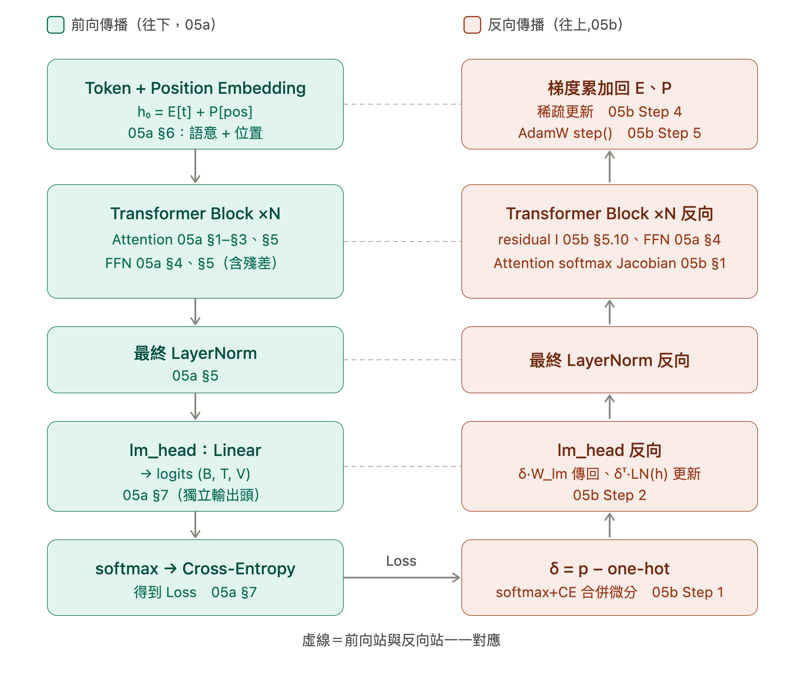

# 04a｜GPT Decoder-Only：基本概念與 Pipeline

> **適合對象：** 讀完 03a 後，想先建立 GPT（Decoder-Only）的整體概念、搞懂它與原始 Transformer 的差異，並掌握前向＋反向的完整資料流（Pipeline）的讀者。
>
> **讀完後你能做什麼：**
> - 解釋為什麼 GPT 只有 Decoder，不需要 Encoder、不需要 Cross-Attention
> - 說清楚 GPT 與原始 Transformer（Encoder-Decoder）的架構差異
> - 用一張 Pipeline 圖串起「Embedding → N × Block → LayerNorm → lm_head → loss」的前向與反向流程
>
> **前置文件：** [`03a-transformer-architecture.md`](03a-transformer-architecture.md)
>
> **數學細節（選讀續篇）：**
> - 前向每個模組的推導 → [`05a1-forward-propagation.md`](05a1-forward-propagation.md)
> - 反向梯度推導＋數值計算 → [`05b1-backward-propagation.md`](05b1-backward-propagation.md)
>
> **對照實作：** → [`04b-nanogpt-walkthrough.md`](04b-nanogpt-walkthrough.md) → [`../notebooks/NB4-nanoGPT.ipynb`](../notebooks/NB4-nanoGPT.ipynb)

---

## 目錄

1. 原始 Transformer 是 Encoder-Decoder
2. GPT 為什麼只要 Decoder？
- 完整 Pipeline 總覽（前向＋反向一覽）

> **本文的定位：** 本文（04a）只講**基本概念、架構差異與 Pipeline 總覽**；前向每個模組的數學推導見 [`05a1`](05a1-forward-propagation.md)（數值範例 [`05a2`](05a2-forward-example.md)）、反向梯度見 [`05b1`](05b1-backward-propagation.md)（數值範例 [`05b2`](05b2-backward-example.md)）、逐行程式對照見 [`04b`](04b-nanogpt-walkthrough.md)。建議 04a → 05a1 → 05a2 → 05b1 → 05b2 → 04b → NB4 依序讀。

---

## 1. 原始 Transformer 是 Encoder-Decoder

2017 年「Attention Is All You Need」提出的原始 Transformer 是為**翻譯任務**設計的 Encoder-Decoder 架構。

先用一個生活比喻建立直覺：把翻譯想成一位**譯者**在工作。他要先「**讀懂**」整句英文（這是 Encoder 的事），再一個字一個字「**寫出**」中文（這是 Decoder 的事）。讀的時候可以來回看整句、前後對照；寫的時候卻只能順著往下寫，還沒寫出來的字當然不能先看。這兩件事分別對應架構裡的兩大模組：

- **Encoder（讀懂輸入）**：雙向（bidirectional）— 處理每個英文詞時，可以同時參考它前面和後面的所有詞，藉此把整句話的語意「消化」成一份內部筆記。
- **Decoder（產生輸出）**：因果（causal，意思是「只受過去影響」）— 逐字生成中文，處理第 $t$ 個位置時只能看自己和它**之前**已經產生的字，不能偷看還沒生成的未來（否則就等於抄答案，訓練與實際生成的情境會不一致）。

那 Decoder 怎麼知道要翻的是哪句英文？答案是 **Cross-Attention（交叉注意力）**。這裡先給最小背景：Attention 的運作可以想成一次「查資料」，由三個角色組成——

- **Query（Q，查詢）**：我現在想找什麼？
- **Key（K，索引）**：每筆資料的標籤是什麼？
- **Value（V，內容）**：每筆資料實際的內容是什麼？

拿 Q 去和每個 K 比對相似度，愈相似的那筆，它的 V 就被取用愈多（Q/K/V 的完整推導見 [`05a1-forward-propagation.md`](05a1-forward-propagation.md) §1 與 [`03a-transformer-architecture.md`](03a-transformer-architecture.md) §2）。**Self-Attention** 是 Q、K、V 都來自同一串序列（自己查自己）；而 **Cross-Attention** 讓 Decoder 拿自己的 **Q**（「我下一個中文字該對到哪裡？」）去查 Encoder 那份筆記的 **K/V**（英文各詞的語意），這樣寫中文時就能對準正在翻的英文詞。資料流如下：

```
英文句子 → [Encoder] ──讀懂後產出 K, V（一份語意筆記）
                           │
                           ▼
中文前綴 → [Decoder] ──用自己的 Q 查 Encoder 的 K/V──▶ 下一個中文字
        （Cross-Attention：Q 來自 Decoder，K/V 來自 Encoder）
```

整理成一張表，三個模組各司其職：

| 模組 | 看的範圍 | 用途 |
|---|---|---|
| Encoder Self-Attention | 雙向（全序列）| 讀懂輸入句的語意 |
| Decoder Self-Attention | 因果（只看過去）| 生成時不偷看未來 |
| Decoder Cross-Attention | Q 來自 Decoder，K/V 來自 Encoder | 讓輸出對齊輸入 |

**一句話總結：** Encoder 負責「讀懂」、Decoder 負責「寫出」，兩者靠 Cross-Attention 對接。記住這個分工，下一節就能看懂 GPT 為什麼可以把 Encoder 整個拿掉。

---

## 2. GPT 為什麼只要 Decoder？

回到第 1 節的比喻：翻譯需要「先讀懂英文、再寫出中文」兩件事，所以要 Encoder＋Decoder。但 GPT 做的不是翻譯，而是**語言建模**——它只做「接話」這一件事：

> 給定一段文字 $x_1, x_2, \ldots, x_t$，預測下一個詞 $x_{t+1}$。

例如看到「今天天氣真」，模型要預測下一個字很可能是「好」。這裡**沒有另一種語言要先讀懂**，從頭到尾只有同一個文字串流，一路往下接。既然不存在「來源句」這個東西：

- **不需要 Encoder** — 沒有一段獨立的來源序列要先消化成筆記。
- **不需要 Cross-Attention** — Encoder 都不存在了，自然沒有別人的 K/V 可查（回顧 §1：Cross-Attention 就是拿 Q 去查 Encoder 的 K/V）。
- **只需要 Decoder 的 Causal Self-Attention** — 「接話」和「逐字寫中文」一樣是順著往下、不能偷看未來，所以保留 Decoder 那套「只看過去」的自注意力就夠了。

**結果：** GPT 把原始 Transformer 裡的 Decoder 單獨拿出來（連帶拿掉它內部的 Cross-Attention），堆疊 $N$ 層，就是完整模型——**架構其實比原始 Transformer 更簡單**。

```
原始 Transformer：Encoder + Decoder + Cross-Attention
GPT：            只有 N 層 Causal Decoder Block
```

| 架構 | 模型代表 | 典型用途 |
|---|---|---|
| Encoder only | BERT | 分類、問答（雙向理解）|
| Decoder only | GPT, LLaMA | 文字生成、語言建模 |
| Encoder-Decoder | T5, 原始 Transformer | 翻譯、摘要（seq2seq）|

> 本文往下只談 Decoder-Only。Encoder-Only（BERT）那一支——雙向注意力、MLM 預訓練、預訓練+微調——是主線的選讀分支，見 [`07-bert-encoder-only.md`](07-bert-encoder-only.md)。

Decoder-Only 架構確定了，但還有一個問題：訓練時如果讓模型看到未來的詞，等於作弊——這靠**因果遮罩（Causal Masking）**阻止，數學細節見 [`05a1-forward-propagation.md`](05a1-forward-propagation.md) §2（在此之前，05a1 §1 先把「Attention 到底在算什麼」寫成數學）。

事實上，目前的頂級主流大型語言模型（例如 ChatGPT、Claude、Gemini、LLaMA 等），其核心本質全都屬於 **Decoder-Only（僅解碼器）** 的架構，而不是把這三種架構混在一起。

原因在於：Decoder-Only 用更簡單、更統一的結構（對照上面 Encoder-Decoder 的複雜度就有感），換來更高的計算效率；而且只要把任務改寫成「接話」的形式，它就能涵蓋包含「翻譯」在內的各種通用任務——例如把輸入寫成「請翻譯成英文：今天天氣真好 →」，模型接著往下生成譯文即可。

還有一個常被忽略、卻決定性的優勢：next-token 目標**不需要成對資料**。翻譯那類 Encoder-Decoder 任務得備妥「來源句＋目標句」的對照語料，量少又貴；GPT 只是「猜下一個字」，任何一大批純文字（網頁、書籍、程式碼……）不必人工標註或配對就能拿來訓練。這正是 GPT 系列能吃下整個網路規模文字的根本原因。

---

## 完整 Pipeline 總覽

在鑽進數學之前，先用一張**前向＋反向的速查圖**掌握全局——看資料怎麼一路流成 loss、梯度又怎麼一路流回 Embedding。圖中每一步都標了對應節號：前向數學見 [`05a1-forward-propagation.md`](05a1-forward-propagation.md)、反向數學與數值見 [`05b1-backward-propagation.md`](05b1-backward-propagation.md)。



因為有因果遮罩（05a1 §2），一次 forward 就同時算出序列中每個位置「預測下一個 token」的 loss，一次 backward 就更新全部參數——這條前向產生 loss、反向回灌梯度的迴圈，重複跑就是 nanoGPT 的完整訓練。

---

## 下一步

**前向每個模組的數學推導：** → [`05a1-forward-propagation.md`](05a1-forward-propagation.md)

把 Pipeline 前向那半邊逐節寫成式子：Scaled Dot-Product、Causal Masking、Multi-Head、FFN、LayerNorm／Pre-LN、Embedding／PE、Cross-Entropy。想看實際數字，配套的 [`05a2-forward-example.md`](05a2-forward-example.md) 用一組範例資料（T=2、d=3）把每個階段算一次。

**反向梯度推導：** → [`05b1-backward-propagation.md`](05b1-backward-propagation.md)

把 loss 沿同一條路徑反向傳回 Embedding 的完整梯度鏈；逐階段的數值計算（沿用 05a2 的數字）見 [`05b2-backward-example.md`](05b2-backward-example.md)。對應 [`../notebooks/NB3-llm-backpropagation.ipynb`](../notebooks/NB3-llm-backpropagation.ipynb)（NumPy 手刻反向傳播）。

**對照程式實作：** → [`04b-nanogpt-walkthrough.md`](04b-nanogpt-walkthrough.md) → [`../notebooks/NB4-nanoGPT.ipynb`](../notebooks/NB4-nanoGPT.ipynb)

把數學對回 nanoGPT 的 `Head` / `MultiHeadAttention` / `FeedForward` / `Block` / `GPT`，並補上 Tokenizer、自迴歸生成、KV Cache 與「打開 nanoGPT 之前的速查清單」。

**若想銜接 LLaMA 等當代模型：** → [`06-modern-transformer-variants.md`](06-modern-transformer-variants.md) — RMSNorm、RoPE 等 nanoGPT → LLaMA 之間的架構演化
